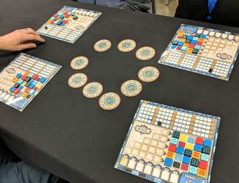

# azul-generator

This generates randomized tile walls for the board game [Azul](https://boardgamegeek.com/boardgame/230802/azul).

Here it is in action at SHUX 2018.  Four of us used the same generated tile
wall and each chose how we wanted to rotate it:

~~Currently, you can download a single randomized board [here](https://dev.azul.dropd.com/board).~~
~~You can print it from there (print multiple copies for multiple players to use the same board),~~
~~or even save the PDF. If you want a different board, just reload the page in your browser.~~

_October 17:_ I'm in the midst of building a proper little site with a stable 'production'
version.  In the meantime, there's an example PDF [here](https://boardgamegeek.com/filepage/164845/randomized-azul-board).

# Development Notes

The application is written in Typescript and deployed as an AWS Lambda function.

So far only "dev" versions are deployed. I haven't progressed far enough with
the project to have dev/qa/prod environments yet.

It can be deployed using AWS tools, or using the Serverless framework.

## Run it locally from the command line

    $ make build

    $ node dist/cli
    YTKBR KBYT- BKRYT TYBK- R-T-B
    TKBRY BTKYR YBTK- KYRBT R-YTB
    BYTRK YTRKB KBYTR RKBYT TRKBY
    board written to './local.pdf'

## AWS Tools

This version is deployed to `us-west-2`.

### Create the infrastructure

The `infrastructure` folder contains a generated CloudFormation template and associated
files for deploying the stack.  Run the `deploy-all.sh` script to create the needed resources.

### Deploy the Lambda using the AWS API

    $ make deploy

To download a PDF from currently deployed instance:

    $ make pdf
    https://8x0vqwvi0a.execute-api.us-west-2.amazonaws.com/AzulGenerator/board
    written to 'board.pdf'

## Using Serverless

Serverless handles both the stack and application deployments.

I've been deploying this version to `us-east-1`.

### Deploy with Serverless

You'll need to build the app first:

    $ make build

Then you can deploy it:

    $ serverless deploy -v
    Serverless: Packaging service...
    Serverless: Excluding development dependencies...
    Serverless: Uploading CloudFormation file to S3...
    Serverless: Uploading artifacts...
    Serverless: Uploading service .zip file to S3 (12.32 MB)...
    Serverless: Validating template...
    Serverless: Updating Stack...
    Serverless: Checking Stack update progress...
    CloudFormation - UPDATE_IN_PROGRESS - AWS::CloudFormation::Stack - azul-generator-dev
    ...
    CloudFormation - UPDATE_COMPLETE - AWS::CloudFormation::Stack - azul-generator-dev
    Serverless: Stack update finished...
    Service Information
    service: azul-generator
    stage: dev
    region: us-east-1
    stack: azul-generator-dev
    api keys:
      None
    endpoints:
      GET - https://t0b2yj7k70.execute-api.us-east-1.amazonaws.com/dev/board-serverless.pdf
    functions:
      azul: azul-generator-dev-azul

    Stack Outputs
    AzulLambdaFunctionQualifiedArn: arn:aws:lambda:us-east-1:625907101871:function:azul-generator-dev-azul:4
    ServiceEndpoint: https://t0b2yj7k70.execute-api.us-east-1.amazonaws.com/dev
    ServerlessDeploymentBucketName: azul-generator-dev-serverlessdeploymentbucket-19n5awfzb5mgu

You can hit that `GET` endpoint directly with your browser, or invoke it like this:

    $ serverless invoke -f azul -l
    {
        "statusCode": 200,
        "headers": {
            "Content-Type": "application/pdf"
        },
        "body":
            "JVBERi0xLjMKJf8KNiAwIG9iago8PAovVH
            ...
            +CnN0YXJ0eHJlZgoyMzAzCiUlRU9GCg==",
        "isBase64Encoded": true
    }
    --------------------------------------------------------------------
    START RequestId: 51998bc6-cd8d-11e8-8ef0-7b86d5d0f9bf Version: $LATEST
    2018-10-11 12:39:07.818 (-07:00)	51998bc6-cd8d-11e8-8ef0-7b86d5d0f9bf	BKYRT RYBTK YTRKB KRTY- TBK-R
    2018-10-11 12:39:07.819 (-07:00)	51998bc6-cd8d-11e8-8ef0-7b86d5d0f9bf	YRTBK BYRKT KTBYR RBKTY TKYRB
    2018-10-11 12:39:07.937 (-07:00)	51998bc6-cd8d-11e8-8ef0-7b86d5d0f9bf	42
    END RequestId: 51998bc6-cd8d-11e8-8ef0-7b86d5d0f9bf
    REPORT RequestId: 51998bc6-cd8d-11e8-8ef0-7b86d5d0f9bf	Duration: 123.42 ms	Billed Duration: 200 ms 	Memory Size: 1024 MB	Max Memory Used: 51 MB

## Logs and Monitoring

The Lambda logs are in the usual place in CloudWatch.  There are no visitor logs per se yet.
No metrics have been set up in CloudWatch yet.